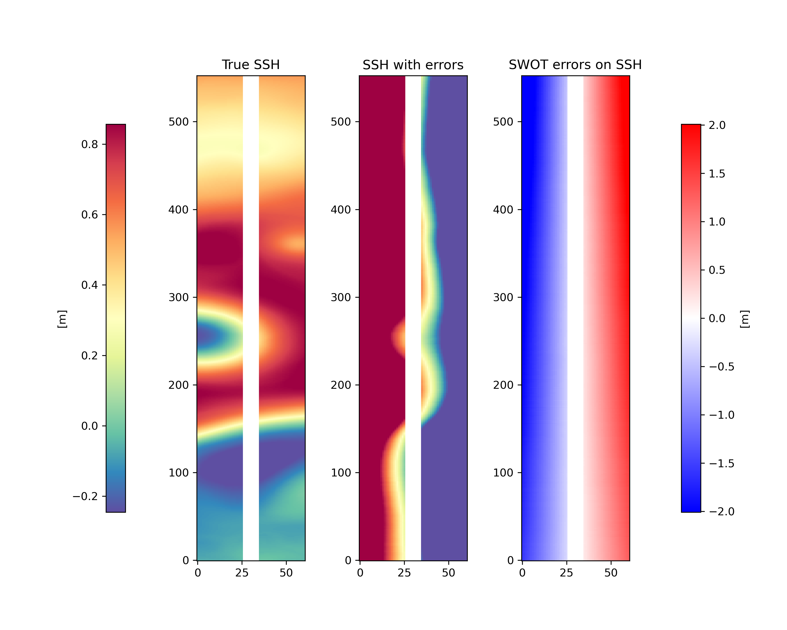

# SWOT error calibration Gulf Stream 2022c
A challenge on the SWOT satellite error calibration organised by Datlas, IGE, IMT Altlantique and CLS.


## 1. Context & Motivation

The two-dimensional sea level SWOT products are very much expected to be a game changer in many oceanographic applications which will make them an unprecedented L3 product to be distributed. The row SWOT data will however be contaminated by instrumental and geophysical errors ([Gauthier et al., 2016](https://journals.ametsoc.org/view/journals/atot/33/1/jtech-d-15-0160_1.xml?tab_body=fulltext-display); [Peral and Esteban-Fernandez, 2018](https://ieeexplore.ieee.org/document/8517385/authors#authors)). In order to be able to observe front, mesoscale and sub-mesoscale features, the SWOT data will require specific processing. Also, these errors are expected to strongly pollute the first and second derivatives of the SSH data which are used for the computation of geostrophic currents and vorticity. Hence, being able to remove the SWOT errors will be of significant importance to recover information on 2D surface currents and vertical mixing.  

The SWOT errors are expected to generate noises that are both correlated on the swath and spatially uncorrelated. Several past efforts have already investigated methods to remove or reduce the correlated noises from the SWOT data using prior knowledge on the ocean state (e.g. [Metref et al., 2019](https://www.mdpi.com/2072-4292/11/11/1336), see Figure 2.4.A), calibration from independent Nadir altimeter data (e.g. Febvre et al., 2021, see Figure 2.4.B) or cross-calibration from SWOT data themselves (on-going CNES-DUACS studies). And other efforts focused on reducing the uncorrelated data (Gomez-Navarro et al., [2018](https://www.mdpi.com/2072-4292/10/4/599), [2020](https://www.mdpi.com/2072-4292/12/4/734); Febvre et al., 2021). Yet, so far, no rigorous intercomparison between the recently developed methods has been undertaken and it seems difficult, to this day, to outline the benefits and limitations of favoring one error reduction method from another.

It is important to mention that the SWOT science requirement for uncorrelated noise measurement error specifies that KaRin must resolve SSH on wavelength scales up to 15 km based on the 68th percentile of the global wavenumber distribution.

**The goal of this SWOT Calibration data challenge is to provide a platform to investigate the most appropriate calibration procedures to reduce the <span style="color:red">spatially correlated</span> errors from the SWOT data.** 

You can find another data challenge proposed by Datlas, CLS and IMT-Atlantique if you are interested in filtering only the instrumental (KaRIn) SWOT noise: [here](github.com/ocean-data-challenges/2022a_SWOT_karin_error_filtering).

In practice, the SWOT error calibration data challenge is in the form of an Observing System Simulation Experiment (OSSE) in the Gulf Stream region considering a realistic ocean model simulation (NATL60) as the true ocean state. The SWOT simulator (Gauthier et al., 2016) was then used to create realistic SWOT data with and without correlated errors. Then, various calibration procedures can be tested and compared to the true ocean state.

This data challenge is partly funded by the CNRS, by the CNES and, as part of the **Sea Level Innovations and Collaborative Intercomparisons for the Next-Generation products (SLICING)** project, by the Copernicus Marine Service Evolution (21036-COP-INNO SCI).  


## 2. The experiment

### Experimental setup

The data challenge is in the form of an Observing System Simulation Experiment (OSSE) considering a realistic ocean model simulation, the NEMO high resolution North Atlantic simulation **NATL60**, as the true ocean state in a 10°X10° degree box in the Gulf Stream region. The SWOT simulator ([Gauthier et al., 2016](https://journals.ametsoc.org/view/journals/atot/33/1/jtech-d-15-0160_1.xml?tab_body=fulltext-display)) was then used to create realistic SWOT data with and without instrumental noise. 

The experiment is performed over one SWOT orbital cycle (cycle 13) which contains 270 passes. All other cycles are available to tune or train the filters.

The SWOT data to calibrate (the inputs: **ssh_err**) and their equivalent error-free SWOT data for evaluation (the targets: **ssh_true**) are hosted and available for download on the MEOM opendap server: see **Download the data** section below.
In no way the targets that are available during the evaluation period should be used in the calibration process.   


 
<center><em>Fig.: Example of one target of the data challenge: SWOT data without errors (left), one input of the data challenge: SWOT data with errors (center) and the difference between the two (right). Here, SWOT is "flying" over the NATL60 model simulation in the Gulf Stream region.
</em></center>

### Baseline 

The baseline method is a very simple and straightforward method that removes the averaged on the pass of a linear trend across track. This is supposed to remove all the signal that has the same structure as the roll error (if the roll error was constant over the region). This method is flowed since (1) there are other errors, (2) the roll error is not constant over the region and (3) the method also removes SSH signals that happens to have a linear structure across track. The baseline is performed in the notebook [demo_baseline](https://github.com/SammyMetref/2022c_SWOT_error_calibration_GS/blob/main/notebook/demo_baseline.ipynb).


### Evaluation

The evaluation of the calibration methods is based on the comparison of the SWOT calibrated swaths with the error-free SWOT swaths. It includes two scores, one based on the Root-Mean-Square Error (RMSE), the other a noise-to-signal ratio based on Fourier wavenumber spectra. The evaluation notebook [demo_eval_baseline](https://github.com/SammyMetref/2022c_SWOT_error_calibration_GS/blob/main/notebook/demo_eval_baseline.ipynb) implements the computation of these two scores for the baseline as they appear in the leaderboard. 


## 3. To get started

### Installation
:computer: _**How to get started ?**_

Clone the data challenge repo: 
```
git clone https://github.com/ocean-data-challenges/2022c_SWOT_error_calibration_GS.git
```
create the data challenge conda environment, named env-dc-swot-filtering, by running the following command:
```
conda env create --file=environment.yml 
```
and activate it with:

```
conda activate env-dc-swot-calibration-gs
```
then add it to the available kernels for jupyter to see: 
```
ipython kernel install --name "env-dc-swot-calibration-gs" --user
```

You're now good to go !

[Check out the quickstart](quickstart.ipynb)


### Download the data

The data are hosted on the opendap: [ocean-data-challenges/2022c_SWOT_error_calibration_GS/](https://ige-meom-opendap.univ-grenoble-alpes.fr/thredds/catalog/meomopendap/extract/ocean-data-challenges/2022c_SWOT_error_calibration_GS/catalog.html). 

#### Inputs and targets data

The data needed for the DC are presented with the following directory structure:

```
.
|-- dc_input-output
|   |-- dc_input-output_SWOTcalib_GS.nc

```


To start out download the dataset from the temporary data server, use:

```shell
!wget https://ige-meom-opendap.univ-grenoble-alpes.fr/thredds/fileServer/meomopendap/extract/ocean-data-challenges/2022c_SWOT_error_calibration_GS/dc_input-output/dc_input-output_SWOTcalib_GS.nc

```
and then uncompress the files using `tar -xvf <file>.tar.gz`. You may also use `ftp`, `rsync` or `curl`to donwload the data.
**The inputs are stored in the variable *ssh_err* and the targets are stored in the variable *ssh_true.**

#### Extra training data

If necessary a dataset for *training* purposes is available and can be downloaded using:

```
. 
|--  
``` 


## 4. To compete 

### Leaderboard

| Method   | Field                          |   µ(RMSE) |    λ(SNR1) [km] | Reference                  |
|:---------|--------:|-----------------:|-------------------------------:|:---------------------------|
| No Calib   | Sea Surface Height [m]|        3.395 |         32.4  |  --- |  
| ---   | Geostrophic current [m.s$^-1$]|        9.437 |         70.9  |  --- |  
| ---   | Relative vorticity []|        0.760 |         42.7  |  --- | 
|:---------|--------:|-----------------:|-------------------------------:|:---------------------------|
| Baseline   | Sea Surface Height [m]|        0.930 |         34.7  |  [demo_baseline.ipynb](https://github.com/SammyMetref/2022c_SWOT_error_calibration_GS/blob/main/notebook/demo_baseline.ipynb) |  
| ---   | Geostrophic current [m.s$^-1$]|        0.479 |         30.7  |  [demo_baseline.ipynb](https://github.com/SammyMetref/2022c_SWOT_error_calibration_GS/blob/main/notebook/demo_baseline.ipynb) |  
| ---   | Relative vorticity []|        0.624 |         37.4  |  [demo_baseline.ipynb](https://github.com/SammyMetref/2022c_SWOT_error_calibration_GS/blob/main/notebook/demo_baseline.ipynb) | 

with:

 `µ(RMSE)`: averaged root-mean square error over the swaths 
 
 `λ(SNR1)`: spatial wavelength where SNR=1 along-track for every across-tracks.

 


## Acknowledgement

This data challenge was funded by the CNRS, by the CNES and by the Service Evolution CMEMS project: SLICING, in collaboration with Datlas, IGE, CLS, IMT-Atlantique.

The structure of this data challenge was to a large extent inspired by the [`ocean-data-challenges`](https://github.com/ocean-data-challenges) created for the BOOST-SWOT ANR project.
 


